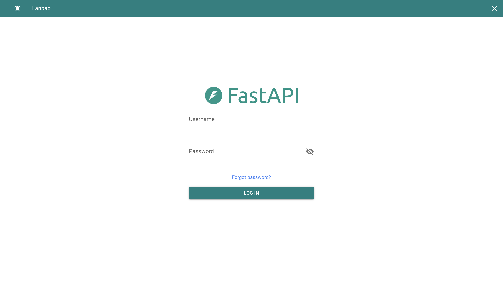

# nicegui-spa
Web SPA template. Replicating [full-stack-fastapi-template](https://github.com/fastapi/full-stack-fastapi-template) using NiceGUI

## Feature

### Login


### Chat


### User Settings


### Admin


### Item


## How to use it

```shell
git clone https://github.com/lanbaoshen/nicegui-spa
cd nicegui-spa
pip3 install uv
uv sync
source .venv/bin/activate
python3 main.py
```
